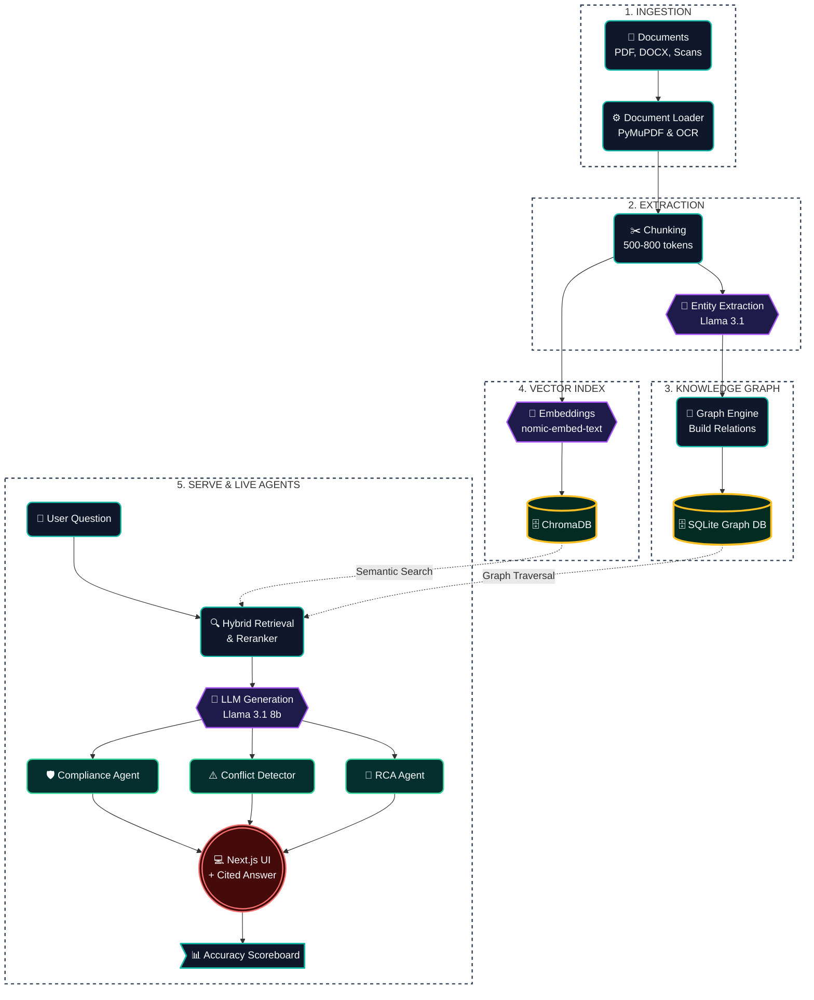

# AETHON Architecture Pipeline

This represents the 5-stage pipeline for the ET AI Hackathon pitch.

```mermaid
graph TD
    %% Aesthetics (Premium Industrial: Teal & Gold)
    classDef default fill:#0f172a,stroke:#14b8a6,stroke-width:2px,color:#f8fafc,rx:8px,ry:8px
    classDef database fill:#022c22,stroke:#fbbf24,stroke-width:3px,color:#f8fafc
    classDef model fill:#1e1b4b,stroke:#a855f7,stroke-width:2px,color:#f8fafc
    classDef agent fill:#042f2e,stroke:#34d399,stroke-width:2px,color:#f8fafc
    classDef ui fill:#450a0a,stroke:#f87171,stroke-width:2px,color:#f8fafc

    %% Subgraph Styling (Removes the default light blue background in dark mode)
    style Stage1 fill:transparent,stroke:#334155,stroke-width:2px,stroke-dasharray: 5 5
    style Stage2 fill:transparent,stroke:#334155,stroke-width:2px,stroke-dasharray: 5 5
    style Stage3 fill:transparent,stroke:#334155,stroke-width:2px,stroke-dasharray: 5 5
    style Stage4 fill:transparent,stroke:#334155,stroke-width:2px,stroke-dasharray: 5 5
    style Stage5 fill:transparent,stroke:#334155,stroke-width:2px,stroke-dasharray: 5 5

    %% Pipeline Stages
    subgraph Stage1 [ 1. INGESTION ]
        Docs(📄 Documents<br/>PDF, DOCX, Scans) --> Loader(⚙️ Document Loader<br/>PyMuPDF & OCR)
    end

    subgraph Stage2 [ 2. EXTRACTION ]
        Loader --> Chunker(✂️ Chunking<br/>500-800 tokens)
        Chunker --> NER{{🧠 Entity Extraction<br/>Llama 3.1}}
    end

    %% Parallel Indexing Paths
    subgraph Stage3 [ 3. KNOWLEDGE GRAPH ]
        NER --> Relator(🔗 Graph Engine<br/>Build Relations)
        Relator --> SQLite[(🗄️ SQLite Graph DB)]
    end

    subgraph Stage4 [ 4. VECTOR INDEX ]
        Chunker --> Embedder{{🧠 Embeddings<br/>nomic-embed-text}}
        Embedder --> Chroma[(🗄️ ChromaDB)]
    end

    subgraph Stage5 [ 5. SERVE & LIVE AGENTS ]
        Query(👤 User Question) --> Reranker(🔍 Hybrid Retrieval<br/>& Reranker)
        
        Chroma -.->|Semantic Search| Reranker
        SQLite -.->|Graph Traversal| Reranker
        
        Reranker --> LLM{{🧠 LLM Generation<br/>Llama 3.1 8b}}
        
        LLM --> Compliance[🛡️ Compliance Agent]
        LLM --> Conflict[⚠️ Conflict Detector]
        LLM --> RCA[🔧 RCA Agent]
        
        Compliance --> UI(((💻 Next.js UI<br/>+ Cited Answer)))
        Conflict --> UI
        RCA --> UI
        
        UI --> Scoreboard>📊 Accuracy Scoreboard]
    end

    %% Apply specific styles
    class SQLite,Chroma database
    class NER,Embedder,LLM model
    class Compliance,Conflict,RCA agent
    class UI ui
```
