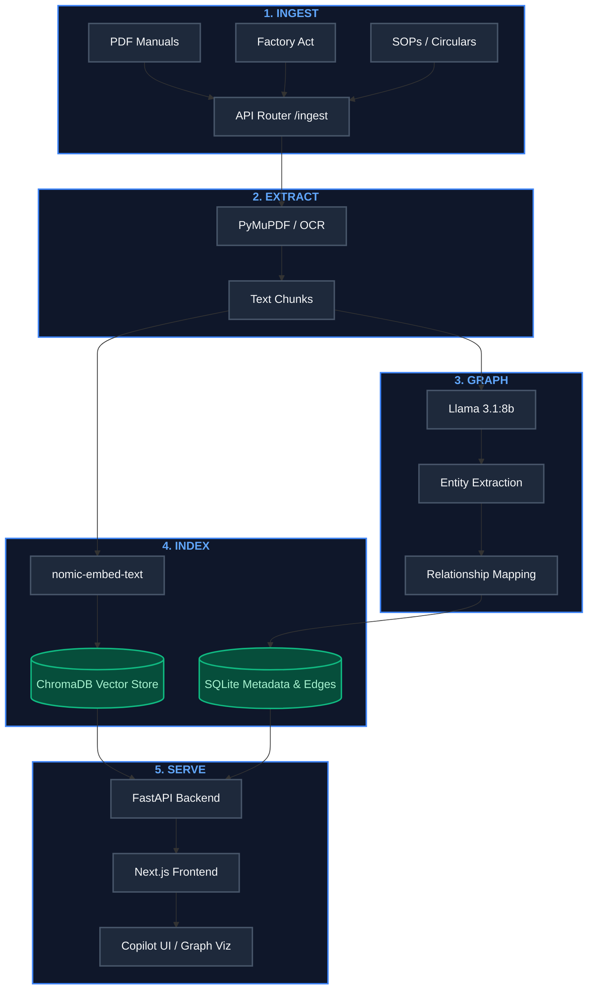

# AETHON Architecture

This diagram illustrates the 5-stage pipeline for AETHON: Ingest, Extract, Graph, Index, and Serve.

```mermaid
flowchart TD
    %% Define Styles
    classDef default fill:#1E293B,stroke:#475569,stroke-width:2px,color:#F8FAFC
    classDef stage fill:#0F172A,stroke:#3B82F6,stroke-width:2px,color:#60A5FA,font-weight:bold
    classDef db fill:#064E3B,stroke:#10B981,stroke-width:2px,color:#A7F3D0

    subgraph INGEST ["1. INGEST"]
        A1[PDF Manuals] --> IN[API Router /ingest]
        A2[Factory Act] --> IN
        A3[SOPs / Circulars] --> IN
    end

    subgraph EXTRACT ["2. EXTRACT"]
        IN --> E1[PyMuPDF / OCR]
        E1 --> E2[Text Chunks]
    end

    subgraph GRAPH ["3. GRAPH"]
        E2 --> G1[Llama 3.1:8b]
        G1 --> G2[Entity Extraction]
        G2 --> G3[Relationship Mapping]
    end

    subgraph INDEX ["4. INDEX"]
        E2 --> I1[nomic-embed-text]
        I1 --> I2[(ChromaDB Vector Store)]
        G3 --> I3[(SQLite Metadata & Edges)]
    end

    subgraph SERVE ["5. SERVE"]
        I2 --> S1[FastAPI Backend]
        I3 --> S1
        S1 --> S2[Next.js Frontend]
        S2 --> S3[Copilot UI / Graph Viz]
    end

    class INGEST,EXTRACT,GRAPH,INDEX,SERVE stage
    class I2,I3 db
```
